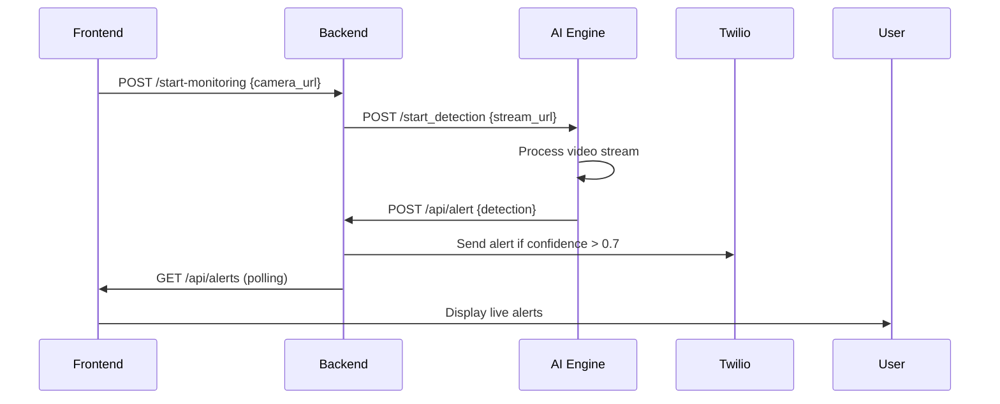

# Intellicam – Smart Predictive Surveillance
**"Your Camera Just Got Intelligent"**

## 🚀 Project Overview
Real-time AI surveillance system that transforms IP cameras into intelligent threat detection tools using YOLOv8 + OpenCV.

## 🏗️ System Architecture
```
[IP Camera Stream] → [AI Engine API] → [Backend API] → [Frontend Dashboard]
                           ↓              ↓              ↓
                    YOLOv8 Detection   Database &     React UI &
                    Object Recognition  Twilio Alerts  Visualization
```

## 📁 Project Structure
```
Intellicam/
├── ai_engine/          # AI Detection Service (Port 8000)
│   ├── ai_api.py       # Flask API for AI engine
│   ├── inference.py    # Original inference script
│   ├── config.py       # Configuration settings
│   ├── requirements.txt
│   └── models/
├── backend/            # Backend API Service (Port 5000)
├── frontend/           # React Dashboard (Port 3000)
└── README.md
```

## 🤖 AI Engine (Completed)

### Features
- YOLOv8 object detection for: knife, scissors, gun, person, car
- Real-time IP camera stream processing
- RESTful API for remote control
- Automatic alert sending to backend

### API Endpoints

#### Start Detection
```http
POST /start_detection
Content-Type: application/json

{
  "stream_url": "http://10.172.201.200:8080/video",
  "stream_id": "camera_1"
}
```

#### Stop Detection
```http
POST /stop_detection
Content-Type: application/json

{
  "stream_id": "camera_1"
}
```

#### Health Check
```http
GET /health
```

### Installation & Usage

1. **Setup Environment**
```bash
cd ai_engine
pip install -r requirements.txt
```

2. **Run AI Engine API**
```bash
python ai_api.py
# Runs on http://localhost:8000
```

3. **Test Detection**
```bash
# Alternative: Run standalone inference
python inference.py --source "http://IP:PORT/video"
```

### Detection Output Format
```json
{
  "object": "knife",
  "confidence": 0.85,
  "timestamp": "2025-11-06T03:15:30",
  "stream_id": "camera_1"
}
```

## 🔧 Backend Integration Guide

### For Backend Engineer (Wisdom)

The AI engine sends POST requests to your backend when objects are detected:

```python
# Your backend should handle this endpoint
@app.route('/api/alert', methods=['POST'])
def receive_alert():
    data = request.json
    # data contains: object, confidence, timestamp, stream_id
    
    # Save to database
    # Send Twilio alert if confidence > 0.7
    
    return {"status": "alert_received"}
```

### How to Control AI Engine from Backend
```python
import requests

# Start detection on IP camera
response = requests.post('http://ai-engine:8000/start_detection', json={
    'stream_url': user_provided_ip_camera_url,
    'stream_id': f'user_{user_id}_camera'
})

# Stop detection
requests.post('http://ai-engine:8000/stop_detection', json={
    'stream_id': f'user_{user_id}_camera'
})
```

## 🎯 Frontend Integration Guide

### For Frontend Engineer (Abdulquadri)

Your React app should:

1. **Collect IP Camera URL from user**
```javascript
const [cameraUrl, setCameraUrl] = useState('');

// Send to backend
const startMonitoring = () => {
  axios.post('/api/start-monitoring', {
    camera_url: cameraUrl
  });
};
```

2. **Display Live Alerts**
```javascript
useEffect(() => {
  const interval = setInterval(() => {
    axios.get('/api/alerts')
      .then(res => setAlerts(res.data));
  }, 1000);
}, []);
```

## 🚀 Deployment Guide

### AI Engine Hosting Options

1. **Railway** (Recommended)
   - Easy Python deployment
   - Automatic HTTPS
   - Free tier available

2. **Render**
   - Good for Flask apps
   - Auto-deploy from GitHub

3. **Google Cloud Run**
   - Serverless container deployment
   - Pay per use

### Environment Variables
```env
BACKEND_URL=https://your-backend.com/api/alert
DETECTION_THRESHOLD=0.5
```

## 🧪 Testing

### Test AI Engine Locally
```bash
# Terminal 1: Start AI engine
python ai_api.py

# Terminal 2: Test detection
curl -X POST http://localhost:8000/start_detection \
  -H "Content-Type: application/json" \
  -d '{"stream_url": "http://10.172.201.200:8080/video", "stream_id": "test"}'
```

### Integration Testing
1. Deploy AI engine
2. Update backend to call AI engine URL
3. Test full flow: Frontend → Backend → AI Engine → Backend → Frontend

## 📋 Next Steps

### For Backend Team
- [ ] Create `/api/alert` endpoint to receive AI detections
- [ ] Add endpoint to start/stop AI detection via AI engine API
- [ ] Integrate Twilio for high-confidence alerts
- [ ] Create `/api/alerts` endpoint for frontend

### For Frontend Team
- [ ] Create IP camera input form
- [ ] Display live detection alerts
- [ ] Add start/stop monitoring controls
- [ ] Show detection statistics and charts

## 🔗 API Integration Flow



## 🏆 Key Features Delivered

✅ **Real-time object detection** (knife, gun, scissors, person, car)  
✅ **IP camera stream processing**  
✅ **RESTful API for remote control**  
✅ **Automatic backend integration**  
✅ **Configurable detection thresholds**  
✅ **Production-ready deployment structure**

---

**AI Engine Status**: ✅ **COMPLETE & READY FOR INTEGRATION**

Contact: Shazily (AI Engineer) for AI engine questions